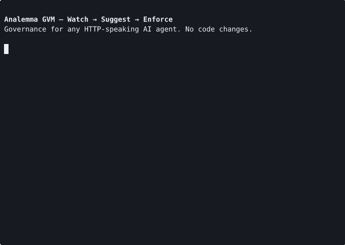

# Analemma-GVM

I wanted to run multiple autonomous AI agents(such as OpenClaw) for my personal affairs. But every time I let agents everything what they wanna do, there was always a little anxiety. What if it does something it shouldn't? What if it leaks personal informations or deletes important datas?

Existing answers (such as NemoClaw, OPA+Envoy) required Docker, an embedded Kubernetes cluster, NVIDIA GPUs, or Envoy sidecars. I wanted a light weight alternative which doesn't need infrastructure settings and highly enforces what agents do.

So I built GVM(Governance Virtual Machine) — an governance runtime that exists between your agent and the actual actions. It is designed assuming that agents can't be fully trusted and can sometimes be hostile. It watches every API call, blocks what you haven't approved, and keeps a tamper-evident log (Merkle chain) of agent's actions.

```
Agent (any framework) → GVM Proxy → External APIs
```

A single Rust binary. No Kubernetes, no service mesh, no sidecar, no GPU. Cooperative and watch modes are pure userspace and build cleanly on Linux, macOS, and Windows — they only need a Rust toolchain. Sandbox mode is Linux-only because it relies on user/PID/mount/net namespaces, seccomp-BPF, and the standard `iproute2` / `iptables` userland that ships with every server distribution. See [Requirements](#requirements) below for the full matrix.

## Demo — Watch → Suggest → Enforce in 3 commands



*33-second GIF, rendered from [`docs/assets/gvm-demo.cast`](docs/assets/gvm-demo.cast).
Replay interactively with `asciinema play docs/assets/gvm-demo.cast`.*

The demo runs the full Watch → Suggest → Enforce loop end-to-end on a real
Ubuntu 24.04 host:

1. **`gvm run --watch demo_agent.py`** — observes every URL the agent calls,
   prints a live stream and a session summary, marks unknown hosts as
   Default-to-Caution.
2. **`gvm run --watch --output json demo_agent.py > session.jsonl`** then
   **`gvm suggest --from session.jsonl > config/srr_network.toml`** — turns
   the recorded session into explicit SRR rules.
3. **`gvm run demo_agent.py`** — enforces. The known URLs land instantly;
   a fourth URL added after the rules were written falls into
   Default-to-Caution and lights up the audit trail with `2 delayed`,
   exactly as the rest of this README describes.

Agent code was not changed between steps. The same `demo_agent.py` and the
same proxy port handle all three runs — only the SRR config and the
agent's URL list differ.

---

## Who needs this

- **Solo devs / small teams** running AI agents in production without a dedicated security team
- **Anyone who's nervous** about giving an agent access to Stripe, Slack, Gmail, or a database API
- **Startups** that need governance and audit trails but can't adopt enterprise infra (OPA, Envoy, NVIDIA NemoClaw)
- **Agent framework users** (OpenClaw, CrewAI, LangChain, AutoGen) who want a safety layer that doesn't require code changes

If you're running agents without any governance tools, you may need this.

---

## Requirements

- **Cooperative / watch modes**: any OS that can run a Rust binary — Linux, macOS, Windows. No system tools required beyond the agent's own runtime (Python, Node, etc.). The pre-built release binary targets Linux x86_64 / glibc; on macOS or Windows, build from source with `cargo build --release`.
- **Pre-built binary**: Linux x86_64, dynamically linked against glibc — works on Ubuntu 20.04+, Debian 11+, RHEL 8+, Amazon Linux 2023, and equivalents. Alpine / other musl distros need a `x86_64-unknown-linux-musl` build from source.
- **`--sandbox` mode**: Linux only. Additionally requires `iproute2` (`ip`), `iptables`, and `ip6tables` on the host (preinstalled on most server distros). `gvm preflight` reports exactly what is missing and prints the install command for your distro. Either run as `sudo` or grant the binary capabilities directly: `sudo setcap 'cap_net_admin,cap_sys_admin,cap_sys_ptrace+ep' ./gvm`.
- **`--contained` mode** (experimental, not stabilized): Docker on the host instead of the kernel features above.

## Quick Start

```bash
# Option 1: Pre-built binary (glibc Linux x86_64)
curl -L https://github.com/skwuwu/Analemma-GVM/releases/latest/download/gvm-linux-x86_64.tar.gz | tar xz

# Option 2: Build from source
git clone https://github.com/skwuwu/Analemma-GVM.git && cd Analemma-GVM
cargo build --release

# Verify your environment (sandbox prerequisites, available modes)
./gvm preflight
```

```bash
# Watch what your agent calls (no blocking)
gvm run --watch my_agent.py

# Generate rules from what you saw
gvm suggest --from data/wal.log > config/srr_network.toml

# Enforce those rules
gvm run my_agent.py

# Production: kernel-level isolation (Linux)
gvm run --sandbox my_agent.py
```

Everything is `gvm run` with flags. Watch → suggest → enforce. [Quick Start →](docs/quickstart.md)

---

## What it does

GVM is the enforcement layer, not a filter. It doesn't read prompts or classify outputs — it intercepts HTTP calls the agent actually makes.

| Decision | What happens | Example |
|----------|-------------|---------|
| **Allow** | Pass through, async audit | `GET api.github.com/repos` |
| **Delay** | Audit first, then forward | Unknown host, first time seen |
| **RequireApproval** | Hold until human approves | `POST api.stripe.com/charges` |
| **Deny** | Block immediately | `DELETE production-db/users` |

The agent never holds API keys. GVM strips whatever the agent sends and injects the real credentials from `config/secrets.toml` — post-enforcement.

### Verify before deployment

```bash
gvm check --agent-id finance-bot --host api.stripe.com --method POST
#  Decision:     RequireApproval
#  Path:         Policy(Allow) + SRR(RequireApproval) → Final(RequireApproval)
#  Latency:      38μs
```

Same classification function as the live proxy — given the same inputs, `gvm check` and live enforcement reach the same decision (rate-limiter and approval state are evaluated at request time and not exercised by `check`).

---

## Modes

GVM has two orthogonal axes: **what to do about rules** (watch / enforce /
discover) and **how isolated the agent runs** (cooperative / sandbox / contained).
Pick one from each column and combine with the corresponding flags.

**Enforcement (`--watch` / none / `-i`)**

| Mode | Command | What it does |
|------|---------|-------------|
| **Watch** | `gvm run --watch agent.py` | Observe every API call, stream to the terminal, no blocking. |
| **Enforce** | `gvm run agent.py` | Apply SRR + ABAC rules, record to the Merkle WAL, return the enforcement decision to the agent. |
| **Discover** | `gvm run -i agent.py` | Enforce + interactively suggest new rules for Default-to-Caution hits on exit. |

**Isolation (`--sandbox` / `--contained` / none)**

| Mode | Command | Trust model |
|------|---------|-------------|
| **Cooperative** (default) | `gvm run agent.py` | `HTTP_PROXY`/`HTTPS_PROXY` env vars are injected. The agent's HTTP client must honour them. A non-cooperating client that opens a raw socket to port 443 bypasses the proxy. Suitable for agents you wrote or trust to use standard libraries (Python `requests`, Node `fetch`/`undici`, curl). |
| **Sandbox** | `gvm run --sandbox agent.py` | Linux user/PID/mount/net namespaces + seccomp-BPF + iptables DNAT. All outbound port 443 is rewritten to the proxy's MITM listener at the kernel level. The agent has no userspace path to the network except through GVM — there is no env var to unset, and a non-cooperating client opening a raw socket is redirected at the kernel level. Works with any runtime (Python, Node, Go, arbitrary binaries). |
| **Contained** (experimental) | `gvm run --contained agent.py` | Docker `--internal` network + DNAT, same trust properties as sandbox but with Docker as the boundary. |

**Combining the two axes** — `--watch` and `--sandbox` compose freely:

```bash
gvm run --watch --sandbox agent.py
```

gives you "observe everything, no rules applied, but the agent is still
namespace-isolated." This is the safest way to profile an untrusted
third-party agent for the first time — you see every call it tries to
make, and it can't phone home even if it wants to.

The demo at the top of this README uses pure cooperative mode for brevity,
but the same three commands work with `--sandbox` added to each line.

---

## What it doesn't do

- **Not a prompt filter.** Use Lakera or provider safety for that. GVM governs actions, not words.
- **Not a replacement for OPA.** OPA governs service-to-service. GVM governs agent-to-world.

| | LLM Provider Safety | Prompt Guards (Lakera) | **GVM** |
|---|---|---|---|
| **Controls** | Model output content | Model input/output | **Agent actions (HTTP calls)** |
| **Enforcement** | Inside the model | Before/after model | **Between agent and APIs** |
| **Audit** | Provider logs (you don't own) | Prompt logs | **Merkle WAL (you own)** |

[Full analysis →](docs/security-layers.md)

---

## Technical facts

- Rust, ~17MB release binary, ~10MB RSS at idle
- Policy evaluation < 1μs (SRR + ABAC, no heap allocation on hot path)
- WAL with Merkle chain, size-based rotation (100MB x 10 segments). Local storage — bring your own retention (S3, GCS, etc)
- 329 tests, 60-min chaos stress test (proxy kill, network partition, disk pressure) — [PASS](docs/test-report.md#910-chaos-stress-test-60-minutes)
- seccomp-BPF with ~130 whitelisted syscalls, ENOSYS default for unknown
- Sandbox auto-cleanup via per-PID state files (Docker pattern)

---

## Documentation

| Doc | What it covers |
|-----|----------------|
| [Quick Start](docs/quickstart.md) | Build, run, isolate |
| [Reference](docs/reference.md) | Config, CLI, API, CI/CD |
| [Security Model](docs/security-model.md) | Threat model, known attack surface (not externally audited) |
| [Governance Coverage](docs/governance-coverage.md) | Per-mode enforcement matrix |
| [Changelog](docs/internal/CHANGELOG.md) | Roadmap, implementation log |

---
- Feedback on technical and structural issues or bug reports is always welcome!

v0.4 pre-release. Apache 2.0. [Issues →](https://github.com/skwuwu/Analemma-GVM/issues)
